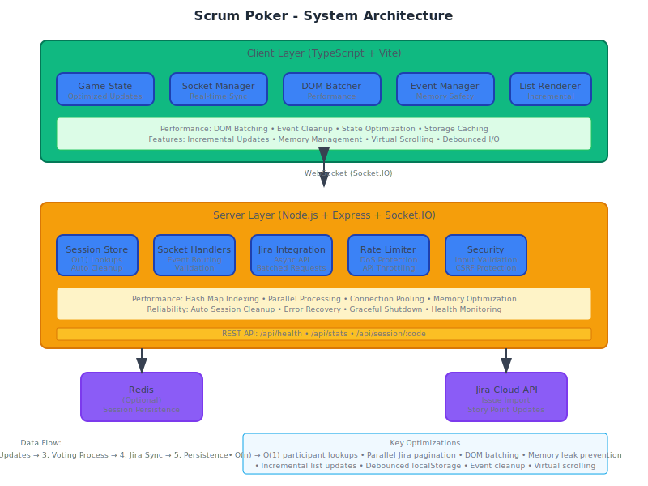

# 🃏 Scrum Poker

A real-time, self-hosted Planning Poker application for agile teams to estimate story points collaboratively. Built with modern web technologies and optimized for performance.

## ✨ Features

- **Real-time Collaboration**: WebSocket-based instant updates across all participants
- **Jira Integration**: Direct import of issues and automatic story point updates
- **Role Management**: Facilitator controls with participant moderation
- **Session Persistence**: Redis-backed session storage with automatic cleanup
- **Performance Optimized**: Advanced optimizations for large teams and data sets
- **Security First**: Input validation, CSRF protection, and secure credential handling
- **Mobile Responsive**: Works seamlessly on desktop and mobile devices
- **Chat System**: Built-in team communication with typing indicators
- **History Tracking**: Complete estimation history and team statistics
- **Customizable Layout**: Drag-and-drop dashboard with collapsible cards

## 🏗️ Architecture



*[View detailed architecture diagram](docs/architecture.svg)*

### Component Breakdown

#### **Client Architecture**
- **TypeScript Frontend**: Type-safe client application with modern ES modules
- **State Management**: Optimized game state with incremental updates
- **Socket Management**: Real-time communication with automatic reconnection
- **Performance Layer**: Custom utilities for DOM batching, event management, and memory optimization

#### **Server Architecture**
- **Express Server**: RESTful API with health checks and session endpoints
- **Socket.IO**: Real-time WebSocket communication with room-based sessions
- **Session Store**: Hybrid memory + Redis storage with automatic cleanup
- **Jira Integration**: Async API client with batched pagination and error handling

#### **Data Flow**

1. **Session Creation**: Facilitator creates session → Server generates room code → Participants join
2. **Real-time Updates**: Socket events broadcast state changes to all room participants
3. **Voting Process**: Participants vote → Server aggregates → Results revealed to all
4. **Jira Sync**: Fetch issues → Estimate → Update story points → Sync back to Jira
5. **Persistence**: Sessions auto-save to Redis → Cleanup after timeout

## 🚀 Quick Start

### Prerequisites

- Node.js 18+ 
- npm or yarn
- Optional: Redis for session persistence
- Optional: Jira Cloud instance for integration

### Installation

```bash
# Clone the repository
git clone <repository-url>
cd scrumpoker

# Install dependencies
npm install

# Copy environment configuration
cp .env.example .env

# Configure environment variables
nano .env
```

### Environment Configuration

```bash
# Server Configuration
PORT=3000
NODE_ENV=development
MAX_SESSIONS=50
SESSION_TIMEOUT=86400000  # 24 hours in milliseconds

# Security
CORS_ORIGIN=*
TRUST_PROXY=false

# Redis (Optional - for session persistence)
REDIS_URL=redis://localhost:6379

# Jira Integration (Optional)
JIRA_STORYPOINT_FIELD=customfield_10016
```

### Development

```bash
# Start development server with hot reload
npm run dev

# Build for production
npm run build

# Start production server
npm start

# Run with Windows-specific build
npm run build:win && npm start
```

### Docker Deployment

```bash
# Build and run with Docker
docker build -t scrum-poker .
docker run -p 3000:3000 scrum-poker

# Or use docker-compose for Redis integration
docker-compose up
```

## 🔧 Configuration

### Session Management

- **Memory Storage**: Default in-memory sessions (development)
- **Redis Storage**: Production-ready persistent sessions
- **Cleanup**: Automatic removal of inactive sessions
- **Tokens**: Secure session tokens for reconnection

### Jira Integration

1. Navigate to Jira Settings → API Tokens
2. Create a new API token
3. Configure domain, email, and token in the application
4. Select project/board for issue import
5. Estimate issues and sync story points back

### Performance Tuning

The application includes several performance optimizations:

- **Client-side**: DOM batching, incremental updates, memory management
- **Server-side**: O(1) lookups, async processing, connection pooling
- **Network**: WebSocket compression, rate limiting, efficient serialization

## 📱 Usage

### Creating a Session

1. Enter your name and session name
2. Click "Start Session" to create a new room
3. Share the room code or link with team members
4. Configure Jira integration (optional)

### Joining a Session

1. Enter your name and the 6-character room code
2. Choose role: Participant (can vote) or Viewer (observe only)
3. Click "Join Session"

### Estimating Stories

1. **Manual Entry**: Type story description and start voting
2. **Jira Integration**: Import issues from selected board
3. **Voting**: Each participant selects story point estimate
4. **Reveal**: Facilitator reveals all votes simultaneously
5. **Finalize**: Consensus reached → Update Jira (if integrated)

### Advanced Features

- **Chat**: Built-in team communication
- **History**: Track all estimations and statistics
- **Moderation**: Remove participants, change roles
- **Layout**: Customize dashboard with drag-and-drop
- **Export**: Download estimation history and statistics

## 🛡️ Security

### Input Validation
- Server-side validation for all inputs
- Client-side sanitization for XSS prevention
- Rate limiting to prevent abuse

### Session Security
- Secure session tokens for reconnection
- CSRF protection with validation
- No persistent storage of sensitive credentials

### Production Headers
- Content Security Policy (CSP)
- HTTPS enforcement (Strict-Transport-Security)
- Security headers (X-Frame-Options, X-XSS-Protection)

## 🔌 API Reference

For complete API documentation including all endpoints, events, and examples, see the [API Documentation](docs/api.md).

### Quick Reference

**REST Endpoints:**
- `GET /api/health` - Server health check
- `GET /api/stats` - Server statistics  
- `GET /api/session/:code` - Session information

**Key WebSocket Events:**
- `create-session` / `join-session` - Session management
- `submit-vote` / `reveal-votes` - Voting workflow
- `configure-jira` / `set-jira-issue` - Jira integration
- `send-chat-message` / `chatMessage` - Team communication

📖 **[Complete API Documentation →](docs/api.md)**

## 🧪 Testing

```bash
# Run all tests
npm test

# Run with coverage
npm run test:coverage

# Run specific test suite
npm run test:unit
npm run test:integration
```

## 📦 Deployment

For detailed deployment instructions across different platforms, see the [Deployment Guide](docs/deployment.md).

### Quick Deploy Options

- **[Render.com](docs/deployment.md#rendercom-recommended)** - Automatic deployments with SSL
- **[Railway](docs/deployment.md#railway)** - Simple Git-based deployments  
- **[Heroku](docs/deployment.md#heroku)** - Classic PaaS deployment
- **[Docker](docs/deployment.md#docker-deployment)** - Self-hosted containerized deployment

### Environment Variables

| Variable | Description | Default | Required |
|----------|-------------|---------|----------|
| `PORT` | Server port | 3000 | No |
| `NODE_ENV` | Environment | development | No |
| `REDIS_URL` | Redis connection string | - | No |
| `MAX_SESSIONS` | Maximum concurrent sessions | 50 | No |
| `SESSION_TIMEOUT` | Session expiry (ms) | 86400000 | No |
| `CORS_ORIGIN` | CORS allowed origins | * | No |

📖 **[Complete Deployment Guide →](docs/deployment.md)**

## 🤝 Contributing

1. Fork the repository
2. Create a feature branch (`git checkout -b feature/amazing-feature`)
3. Commit your changes (`git commit -m 'Add amazing feature'`)
4. Push to the branch (`git push origin feature/amazing-feature`)
5. Open a Pull Request

### Development Guidelines

- Follow TypeScript best practices
- Add tests for new functionality
- Update documentation as needed
- Ensure performance optimizations are maintained

## 📄 License

This project is licensed under the MIT License - see the [LICENSE](LICENSE) file for details.

## 🙏 Acknowledgments

- Socket.IO for real-time communication
- Express.js for the web framework
- Vite for fast build tooling
- Tailwind CSS for styling
- Redis for session persistence

## 🐛 Troubleshooting

### Common Issues

**Connection Issues**
- Check firewall settings for WebSocket connections
- Verify CORS configuration for production
- Ensure Redis is accessible if configured

**Performance Issues**
- Monitor session count vs. MAX_SESSIONS limit
- Check Redis memory usage
- Review server logs for errors

**Jira Integration**
- Verify API token permissions
- Check domain configuration (no https:// prefix)
- Ensure story point field ID is correct

### Support

For issues and questions:
1. Check the [GitHub Issues](https://github.com/your-repo/issues)
2. Review the troubleshooting guide
3. Create a new issue with detailed information

---

Built with ❤️ for agile teams worldwide